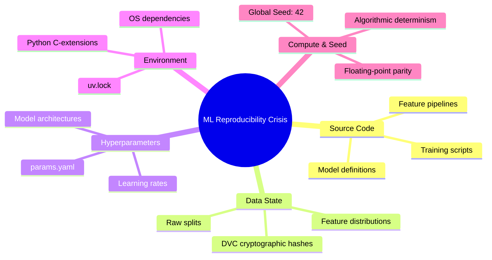
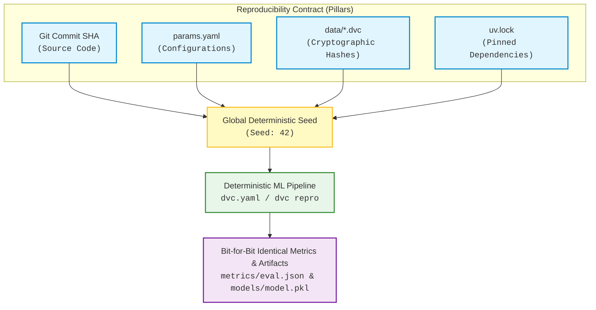
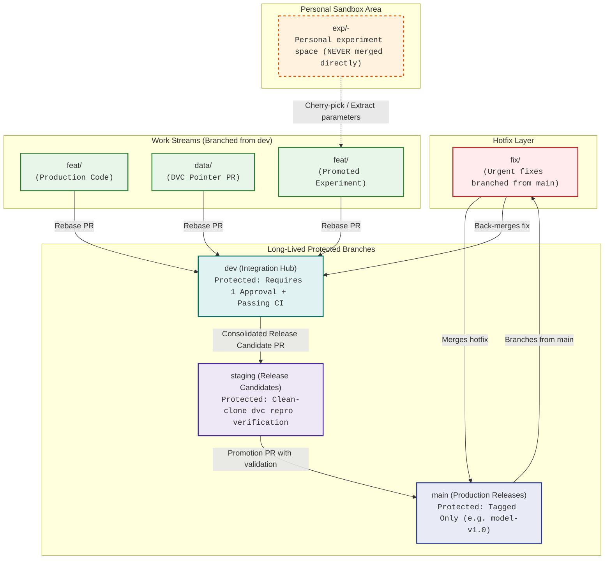
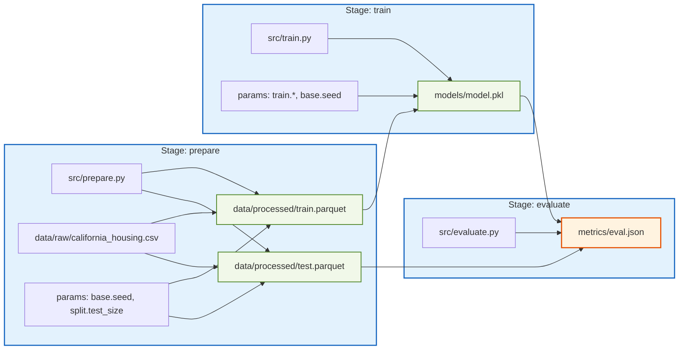

# California Housing MLOps Pipeline: Git-Based Collaboration Master Plan

> **Assignment 01: Complete Master Execution Plan, Work Allocation, and Technical Blueprint**  
> **Repository:** [`nyc_mobility_ml`](https://github.com/m-hassanqureshi/nyc_mobility_ml) | **Benchmark:** California Housing Dataset (~2.8 MB, 20,640 rows) | **Engine:** Scikit-Learn & LightGBM Regressor

---

## Table of Contents

- [1. Executive Summary & Team Charter](#1-executive-summary--team-charter)
  - [The ML Reproducibility Crisis](#the-ml-reproducibility-crisis)
  - [The Reproducibility Contract](#the-reproducibility-contract)
  - [Team Composition & Role Distribution](#team-composition--role-distribution)
- [2. Dataset Selection & Problem Formulation](#2-dataset-selection--problem-formulation)
  - [Benchmark Specifications](#benchmark-specifications)
  - [Feature Dictionary](#feature-dictionary)
- [3. Strict Branching & Git Operational Workflow](#3-strict-branching--git-operational-workflow)
  - [One-Way Integration Flow Architecture](#one-way-integration-flow-architecture)
  - [Branch Taxonomy & Lifecycle Rules](#branch-taxonomy--lifecycle-rules)
- [4. End-to-End Implementation Playbook (Phases 1–9)](#4-end-to-end-implementation-playbook-phases-19)
  - [Phase 1: Team & Repository Setup](#phase-1-team--repository-setup)
  - [Phase 2: Project Scaffolding & Initial Codebase Import](#phase-2-project-scaffolding--initial-codebase-import)
  - [Phase 3: Guard Rails: Pre-Commit Hooks & Secret Scanning](#phase-3-guard-rails-pre-commit-hooks--secret-scanning)
  - [Phase 4: Data & Model Versioning with DVC](#phase-4-data--model-versioning-with-dvc)
  - [Phase 5: Notebook Governance Done Right](#phase-5-notebook-governance-done-right)
  - [Phase 6: A Reproducible End-to-End Pipeline](#phase-6-a-reproducible-end-to-end-pipeline)
  - [Phase 7: Experiments, Team PRs, and Conflict Orchestration](#phase-7-experiments-team-prs-and-conflict-orchestration)
  - [Phase 8: Continuous Integration on Every Pull Request](#phase-8-continuous-integration-on-every-pull-request)
  - [Phase 9: Production Release: dev → staging → main & Hotfix](#phase-9-production-release-dev--staging--main--hotfix)
- [5. Ready-to-Publish REPORT.md Template](#5-ready-to-publish-reportmd-template)
- [6. Step-by-Step Assignment Execution Guide](#6-step-by-step-assignment-execution-guide)
- [7. Authoritative References & Tooling Documentation](#7-authoritative-references--tooling-documentation)

---

## 1. Executive Summary & Team Charter

This master execution plan establishes the technical protocols, division of labor, automation pipelines, and delivery checkpoints for executing **Assignment 01: Git-Based Collaboration for an ML Project**.

### The ML Reproducibility Crisis

Standard software engineering relies on tracking deterministic source code in Git. However, a machine learning system mutates simultaneously across **five independent dimensions**:

1. **Source Code:** Implementation of feature transformations, network architectures, and training routines.
2. **Data State:** Exact training/validation instances, feature distributions, and label encodings.
3. **Hyperparameters:** Batch sizes, learning rates, tree depths, and regularization terms.
4. **Environment:** Binary dependencies, C-extensions, package versions, and underlying OS libraries.
5. **Compute & Seed Execution:** Pseudo-random number generator (PRNG) states, GPU/CPU determinism.



> [!WARNING]
> Storing binary assets (large datasets, serialized model weights) directly in Git causes severe repository bloat, slow clone speeds, and eventual GitHub push rejections. Conversely, tracking datasets externally without strict cryptographic linkage breaks historical guarantees.

---

### The Reproducibility Contract

Our system enforces a formal **Reproducibility Contract**:

$$\text{Reproducibility Contract} = \langle \text{Git Commit SHA}, \; \text{params.yaml}, \; \text{DVC Data Hash}, \; \text{uv.lock}, \; \text{Global Seed (42)} \rangle$$

Given this 5-tuple, any third party or CI runner cloning the repository can re-execute the entire pipeline from cold storage and yield byte-for-byte or floating-point parity metrics ($R^2$, $\text{RMSE}$, $\text{MAE}$).



---

### Team Composition & Role Distribution

| Team Member | Functional Role | Primary Areas of Accountability | Secondary Peer Support |
| :--- | :--- | :--- | :--- |
| **Muhammad Hassan (Lead)** | **Data Owner** | DVC setup, remote storage configuration (S3/DagsHub), data-update PRs, schema definitions, data validation scripts, and conflict orchestration. | Cross-reviews pipeline and model training PRs; monitors git history cleanliness. |
| **Ahmad** | **Model Owner** | Feature extraction routines, LightGBM/Scikit-Learn training pipelines, hyperparameter structuring (`params.yaml`), DVC stage wiring (`dvc.yaml`), metric logging, and experimental forks (`exp/*`). | Authors unit tests for model interfaces; validates pipeline execution speed across local runs. |
| **Moeed** | **Platform & DevOps Owner** | Git repo governance, branch protection rules, pre-commit configuration, secret scanners, `jupytext`/`nbstripout` hooks, GitHub Actions CI/CD workflows, CML integration, and hotfix execution. | Conducts mock audits on fresh clones; asserts environment compatibility across operating systems. |

---

## 2. Dataset Selection & Problem Formulation

### Benchmark Specifications

To ensure continuous integration stability, rapid local iteration, and sub-minute smoke training runs, we select the **California Housing** dataset (derived from the 1990 U.S. Census).

> [!NOTE]
> **Dataset Selection Rationale:** Per the assignment guidelines, datasets must be small tabular benchmarks (under ~50 MB) so pipelines and CI stay fast. While large-scale datasets (such as multi-gigabyte NYC TLC Trip Record taxi partitions) represent real-world enterprise workloads, running them inside standard GitHub Actions runners (which provide only 7 GB of RAM and standard execution timeouts) leads to Out-Of-Memory (OOM) crashes and 30+ minute PR check delays. Furthermore, repeated `dvc pull` and `dvc repro` on multi-gigabyte files introduces severe bandwidth friction for teammates. The **California Housing** benchmark provides an ideal ~2.8 MB tabular regression challenge that runs end-to-end in < 60 seconds while exercising full DVC data tracking, parameter versioning, and deterministic ML pipelines.

- **Task:** Continuous Regression (Median House Value Prediction).
- **Target Feature:** `MedHouseVal` (continuous, measured in hundreds of thousands of dollars: $\$100{,}000$ to $\$500{,}000$).
- **Volume:** $20{,}640$ records, 8 numeric features, 1 target variable ($\sim 2.8\text{ MB}$ in CSV format).
- **Source Attribution:** Derived from the StatLib repository and packaged cleanly via `sklearn.datasets.fetch_california_housing`.
- **Model Architecture:** LightGBM Regressor (`LGBMRegressor`) with Scikit-Learn evaluation pipelines predicting continuous housing prices (`MedHouseVal`).
- **Data Paths:** Standardized to `data/raw/california_housing.csv` (versioned via DVC pointer `california_housing.csv.dvc`) and `data/processed/*.parquet` (`train.parquet`, `test.parquet`).

### Feature Dictionary

| Feature Name | Type | Description | Unit / Scale |
| :--- | :--- | :--- | :--- |
| `MedInc` | Float | Median income in block group | Tens of thousands of USD |
| `HouseAge` | Float | Median house age in block group | Years |
| `AveRooms` | Float | Average number of rooms per household | Count ratio |
| `AveBedrms` | Float | Average number of bedrooms per household | Count ratio |
| `Population` | Float | Block group population | Count |
| `AveOccup` | Float | Average number of household members | Count ratio |
| `Latitude` | Float | Block group latitude | Decimal degrees |
| `Longitude` | Float | Block group longitude | Decimal degrees |
| **`MedHouseVal` (Target)** | Float | Median house value for California districts | $\$100{,}000\text{s}$ |

---

## 3. Strict Branching & Git Operational Workflow

All project contributors must adhere strictly to a **One-Way Integration Flow**. Direct pushes to `dev`, `staging`, or `main` are disabled at the repository level.

### One-Way Integration Flow Architecture



---

### Branch Taxonomy & Lifecycle Rules

#### 1. `main` (Production)
- **Rule:** Stores only code and metadata that correspond to a fully verified, tagged release model.
- **Write Access:** None. Merges only through Pull Requests sourced directly from `staging` (or urgent `fix/*` branches).
- **Tag Policy:** All merges onto `main` are immediately annotated with semantic tags:
  ```bash
  git tag -a model-v1.0 -m "Production release model-v1.0"
  ```

#### 2. `staging` (Release Verification Ground)
- **Rule:** Acts as the staging area where a release candidate is rigorously audited.
- **Verification Requirement:** An independent team member (who did not author the training code) must perform a clean checkout from scratch, execute `dvc pull && dvc repro`, and certify metric stability before promoting to `main`.

#### 3. `dev` (Development & Integration Core)
- **Rule:** The primary active integration branch. All active feature work, dataset adjustments, and operational refactors converge here via reviewed PRs.

#### 4. `feat/<name>` (Feature Branches)
- **Rule:** Branched from `dev`. Scoped to a single, modular functional enhancement (e.g., `feat/add-polynomial-features`, `feat/ci-workflow`). Merged into `dev` via rebase and deleted immediately post-merge.

#### 5. `data/<name>` (Data Updates)
- **Rule:** Dedicated strictly to updating raw or transformed datasets, adding validation rules, or modifying split strategies. Must enforce `dvc push` prior to committing git references.

#### 6. `exp/<member>-<idea>` (Experiment Sandboxes)
- **Rule:** Branched from `dev`. Dedicated spaces for individuals to test hypotheses (e.g., `exp/ahmad-xgboost-baseline`, `exp/hassan-boxcox-transform`, `exp/moeed-lr-sweep`).
- **Strict Constraint:** **Never merged directly into `dev`**. Successful experiments must have their configuration and functional changes selectively applied or cherry-picked into a formal `feat/*` branch. Abandoned experiments remain dormant in the git tree to document dead ends.

#### 7. `fix/<name>` (Emergency Hotfixes)
- **Rule:** Branched directly from `main` to address critical flaws discovered in a production release. Merges back into `main` (generating a patch tag, e.g., `model-v1.0.1`), followed by an immediate back-merge into `dev` to prevent regressions.

---

## 4. End-to-End Implementation Playbook (Phases 1–9)

```mermaid
gantt
    title MLOps Master Execution Timeline
    dateFormat  X
    axisFormat  Day %d

    section Foundation
    Phase 1: Team & Repo Setup       :active, p1, 0, 1
    Phase 2: Scaffolding & Base Code :p2, 1, 3
    Phase 3: Pre-Commit & Guardrails :p3, 2, 4

    section Data & Pipeline
    Phase 4: DVC Tracking & Remotes  :p4, 3, 5
    Phase 5: Notebook Governance     :p5, 4, 6
    Phase 6: End-to-End DVC Pipeline :p6, 5, 7

    section CI & Production
    Phase 7: Experiments & Conflicts :p7, 6, 9
    Phase 8: CI & Automated Testing  :p8, 7, 9
    Phase 9: Staging, Release & Patch:p9, 8, 10
```

---

### Phase 1: Team & Repository Setup

> [!IMPORTANT]
> **Phase 1 Checkpoint:** All members can push isolated branches to the remote repository.

#### Step 1.1: GitHub Repository Initialization & Access Control
- **Owner:** Hassan
- **Actions:**
  1. Access GitHub and utilize repository [`nyc_mobility_ml`](https://github.com/m-hassanqureshi/nyc_mobility_ml).
  2. Navigate to **Settings > Collaborators and teams** and invite Ahmad and Moeed with explicit **Admin / Write** access.
  3. Invite the course instructor as a **Viewer / Read-only** collaborator.
  4. Ensure no initial commits (no auto-generated README, no `.gitignore`) are injected by GitHub during initialization to avoid rebase anomalies.

#### Step 1.2: Local Configuration & Identity Federation
- **Owners:** Hassan, Ahmad, Moeed
- **Actions:** Every member clones the repository and executes deterministic user profiling:

```bash
git clone https://github.com/m-hassanqureshi/nyc_mobility_ml.git
cd nyc_mobility_ml

# Configure unambiguous author signatures
git config user.name "Your Name"
git config user.email "your_email@domain.com"

# Set rebase as the default reconciliation strategy
git config pull.rebase true
```

---

### Phase 2: Project Scaffolding & Initial Codebase Import

> [!IMPORTANT]
> **Phase 2 Checkpoint:** `dev`, `staging`, and `main` branches exist on GitHub with branch protections active; initial import committed cleanly.

#### Step 2.1: Scaffolding Directory Layout
- **Owner:** Hassan
- **Action:** Construct the standard repository hierarchy:

```bash
mkdir -p configs data/raw data/processed models notebooks src tests .github/workflows
touch configs/params.yaml
touch src/__init__.py src/prepare.py src/train.py src/evaluate.py
touch tests/__init__.py tests/test_data_schema.py tests/test_features.py
touch CONTRIBUTING.md README.md REPORT.md
```

The resulting structural tree:

```text
.
├── .github/
│   ├── workflows/
│   │   └── ci.yml
│   └── pull_request_template.md
├── configs/
│   └── params.yaml
├── data/
│   ├── raw/             # Versioned by DVC (Git ignored)
│   └── processed/       # Versioned by DVC (Git ignored)
├── models/              # Versioned by DVC (Git ignored)
├── notebooks/
│   ├── 01_eda.ipynb
│   └── 01_eda.py        # Paired via jupytext
├── src/
│   ├── __init__.py
│   ├── prepare.py
│   ├── train.py
│   └── evaluate.py
├── tests/
│   ├── __init__.py
│   ├── test_data_schema.py
│   └── test_features.py
├── .gitignore
├── .pre-commit-config.yaml
├── CONTRIBUTING.md
├── dvc.yaml
├── dvc.lock
├── pyproject.toml
├── uv.lock
├── README.md
└── REPORT.md
```

#### Step 2.2: Hardened Git Ignore Directives
- **Owner:** Hassan
- **Action:** Construct a rock-solid `.gitignore` file to permanently prevent repository poisoning:

```gitignore
# Operating System Junk
.DS_Store
Thumbs.db

# Python Runtimes & Bytecode
__pycache__/
*.py[cod]
*$py.class
*.so
.Python
build/
develop-eggs/
dist/
downloads/
eggs/
.eggs/
lib/
lib64/
parts/
sdist/
var/
wheels/
*.egg-info/
.installed.cfg
*.egg

# Virtual Environments (uv / venv)
.venv/
env/
venv/
ENV/

# Jupyter Notebook Execution States
.ipynb_checkpoints/
*-checkpoint.ipynb

# IDE Configurations
.idea/
.vscode/
*.swp
*.swo

# Credentials, Secrets & Local Variables
.env
.env.*
secrets.yaml

# ML Tracking & Experiments Local Blobs
mlruns/
.pytest_cache/
.ruff_cache/

# DVC Local & Private Configurations
.dvc/cache
.dvc/tmp
.dvc/config.local

# ML Datasets & Weights (CRITICAL: Never commit to Git)
data/raw/*
!data/raw/.gitkeep
data/processed/*
!data/processed/.gitkeep
models/*
!models/.gitkeep
*.parquet
*.csv
*.pkl
*.joblib
*.onnx
*.h5
```

#### Step 2.3: Environment Locking via `uv`
- **Owner:** Ahmad
- **Action:** Establish deterministic virtual environment isolation using `uv` to lock dependencies precisely down to C-level wheels:

```bash
# Initialize uv project configuration
uv init --no-pin-python

# Add pinned, high-performance production dependencies
uv add pandas==2.2.2 \
       numpy==1.26.4 \
       scikit-learn==1.5.0 \
       pyarrow==16.1.0 \
       lightgbm==4.3.0 \
       pyyaml==6.0.1 \
       dvc==3.51.0 \
       dvc-s3==3.2.0

# Add development and testing dependencies
uv add --dev pytest==8.2.2 \
             ruff==0.4.8 \
             pre-commit==3.7.1 \
             jupytext==1.16.2 \
             nbstripout==0.7.1 \
             cml==0.2.1
```

#### Step 2.4: Import Modular Baseline Code
- **Owner:** Ahmad
- **Action:** Write baseline scripts without hardcoded absolute paths:

**`src/prepare.py`**:
```python
import argparse
from pathlib import Path
import pandas as pd
from sklearn.datasets import fetch_california_housing
from sklearn.model_selection import train_test_split
import yaml


def run_preparation(config_path: str):
    with open(config_path, "r", encoding="utf-8") as f:
        config = yaml.safe_load(f)

    root_dir = Path(__file__).resolve().parent.parent
    raw_dir = root_dir / "data" / "raw"
    processed_dir = root_dir / "data" / "processed"

    raw_dir.mkdir(parents=True, exist_ok=True)
    processed_dir.mkdir(parents=True, exist_ok=True)

    raw_file = raw_dir / "california_housing.csv"
    if not raw_file.exists():
        bunch = fetch_california_housing(as_frame=True)
        df = bunch.frame
        df.to_csv(raw_file, index=False)
    else:
        df = pd.read_csv(raw_file)

    # Enforce absolute isolation of preprocessing
    train_df, test_df = train_test_split(
        df,
        test_size=config["split"]["test_size"],
        random_state=config["base"]["seed"],
    )

    train_df.to_parquet(processed_dir / "train.parquet", index=False)
    test_df.to_parquet(processed_dir / "test.parquet", index=False)


if __name__ == "__main__":
    parser = argparse.ArgumentParser()
    parser.add_argument("--config", default="configs/params.yaml")
    args = parser.parse_args()
    run_preparation(args.config)
```

**`src/train.py`**:
```python
import argparse
from pathlib import Path
import joblib
from lightgbm import LGBMRegressor
import pandas as pd
import yaml


def run_training(config_path: str):
    with open(config_path, "r", encoding="utf-8") as f:
        config = yaml.safe_load(f)

    root_dir = Path(__file__).resolve().parent.parent
    processed_dir = root_dir / "data" / "processed"
    models_dir = root_dir / "models"
    models_dir.mkdir(parents=True, exist_ok=True)

    train_df = pd.read_parquet(processed_dir / "train.parquet")
    X_train = train_df.drop(columns=["MedHouseVal"])
    y_train = train_df["MedHouseVal"]

    regressor = LGBMRegressor(
        n_estimators=config["train"]["n_estimators"],
        learning_rate=config["train"]["learning_rate"],
        max_depth=config["train"]["max_depth"],
        random_state=config["base"]["seed"],
        n_jobs=-1,
    )

    regressor.fit(X_train, y_train)
    joblib.dump(regressor, models_dir / "model.pkl")


if __name__ == "__main__":
    parser = argparse.ArgumentParser()
    parser.add_argument("--config", default="configs/params.yaml")
    args = parser.parse_args()
    run_training(args.config)
```

**`src/evaluate.py`**:
```python
import argparse
import json
from pathlib import Path
import subprocess
import joblib
import numpy as np
import pandas as pd
from sklearn.metrics import mean_absolute_error, mean_squared_error, r2_score


def get_git_commit_hash() -> str:
    try:
        return (
            subprocess.check_output(
                ["git", "rev-parse", "HEAD"], stderr=subprocess.DEVNULL
            )
            .decode("ascii")
            .strip()
        )
    except Exception:
        return "UNKNOWN_COMMIT"


def run_evaluation():
    root_dir = Path(__file__).resolve().parent.parent
    processed_dir = root_dir / "data" / "processed"
    models_dir = root_dir / "models"
    metrics_dir = root_dir / "metrics"
    metrics_dir.mkdir(parents=True, exist_ok=True)

    test_df = pd.read_parquet(processed_dir / "test.parquet")
    X_test = test_df.drop(columns=["MedHouseVal"])
    y_test = test_df["MedHouseVal"]

    model = joblib.load(models_dir / "model.pkl")
    predictions = model.predict(X_test)

    metrics = {
        "rmse": float(np.sqrt(mean_squared_error(y_test, predictions))),
        "mae": float(mean_absolute_error(y_test, predictions)),
        "r2": float(r2_score(y_test, predictions)),
        "git_commit_sha": get_git_commit_hash(),
    }

    with open(metrics_dir / "eval.json", "w", encoding="utf-8") as f:
        json.dump(metrics, f, indent=4)


if __name__ == "__main__":
    run_evaluation()
```

#### Step 2.5: Initial Commit, Branch Initialization, and Remote Protections
- **Owner:** Hassan
- **Action:** Commit the clean baseline, create long-lived branches, and push to GitHub:

```bash
git add .
git commit -m "chore: scaffold project structure, configure uv.lock, and baseline src"
git branch -M main
git push -u origin main

# Spin off permanent long-lived integration branches
git checkout -b staging
git push -u origin staging

git checkout -b dev
git push -u origin dev
```

#### Step 2.6: Configure GitHub Branch Protection Rules
- **Owner:** Moeed
- **Action:**
  1. In the GitHub repository, navigate to **Settings > Branches**.
  2. Click **Add branch protection rule** for `main`, `staging`, and `dev` respectively.
  3. Enforce the following parameters across all three:
     - [x] **Require a pull request before merging**
     - [x] **Require approvals:** Set to at least **1 approval**
     - [x] **Dismiss stale pull request approvals when new commits are pushed**
     - [x] **Require status checks to pass before merging** (bind to Continuous Integration after Phase 8)
     - [x] **Require linear history** (enforce rebase-merging)
     - [x] **Do not allow bypassing the above settings**
     - [x] **Block force pushes**
     - [x] **Block deletions**

#### Step 2.7: Establish `CONTRIBUTING.md`
- **Owner:** Moeed
- **Action:** Commit `CONTRIBUTING.md` onto `dev` via an explicit pull request:

```markdown
# Team Collaboration Guidelines

## 1. Branch Strategy and Ownership Rules
* Under no circumstances is any engineer permitted to push directly to `dev`, `staging`, or `main`.
* Branch names MUST follow the strict naming grammar:
  - `feat/<feature-name>`: Implementation of new code logic, architectural steps, refactoring.
  - `data/<dataset-update>`: Upstream data additions, cleaning changes, DVC manifest updates.
  - `exp/<author>-<hypothesis>`: Sandbox branches for personal iterations. Never merged directly.
  - `fix/<issue-name>`: Critical emergency hotfixes branched directly from `main`.

## 2. Commit Message Standards (Conventional Commits)
All commit messages must adopt the Conventional Commits structure:
* `feat:` A new functional pipeline capability or preprocessing step.
* `fix:` A bug fix or patch.
* `data:` Alterations to raw or processed data representations (must be accompanied by DVC push).
* `docs:` Adjustments strictly to markdown, guidelines, or docstrings.
* `style:` Formatting changes that do not alter execution behavior (ruff format).
* `refactor:` Code improvements that do not fix bugs or add functional capabilities.
* `test:` Introducing or repairing pytest validation suites.
* `chore:` Build dependencies, pre-commit settings, or workflow maintenance.

## 3. Merge Methodology
* Pull Requests into `dev` are strictly **Rebase-Merged** to maintain a linear Git history.
* Squash-merging is permitted ONLY for exploratory experimentation PRs if intermediate commits contain non-compiling states.
```

---

### Phase 3: Guard Rails: Pre-Commit Hooks & Secret Scanning

> [!IMPORTANT]
> **Phase 3 Checkpoint:** A synthetic commit containing a 5 MB binary payload or a mock AWS API key is blocked locally by the pre-commit hook. Screenshots preserved for `REPORT.md`.

#### Step 3.1: Pre-Commit Configuration
- **Owner:** Moeed (on branch `feat/pre-commit-gates`)
- **Actions:**
  1. Create the branch:
     ```bash
     git checkout dev
     git pull origin dev
     git checkout -b feat/pre-commit-gates
     ```
  2. Author `.pre-commit-config.yaml`:
     ```yaml
     repos:
       - repo: https://github.com/pre-commit/pre-commit-hooks
         rev: v4.6.0
         hooks:
           - id: check-added-large-files
             args: ['--maxkb=1024'] # 1 MB strict cutoff
           - id: detect-private-key
           - id: check-case-conflict
           - id: check-merge-conflict
           - id: end-of-file-fixer
           - id: trailing-whitespace
           - id: check-yaml
             args: ['--unsafe']

       - repo: https://github.com/astral-sh/ruff-pre-commit
         rev: v0.4.8
         hooks:
           - id: ruff
             args: [--fix, --exit-non-zero-on-fix]
           - id: ruff-format

       - repo: https://github.com/kynan/nbstripout
         rev: 0.7.1
         hooks:
           - id: nbstripout

       - repo: https://github.com/gitleaks/gitleaks
         rev: v8.18.2
         hooks:
           - id: gitleaks
     ```
  3. Install hooks across all local contributor environments:
     ```bash
     uv run pre-commit install
     ```

#### Step 3.2: Verification and Intentional Failure Audit
- **Owner:** Moeed
- **Action:** Trigger artificial failure states to capture verification evidence for `REPORT.md`:

```bash
# Test 1: Fabricate a 5 MB binary file to trigger check-added-large-files
dd if=/dev/urandom of=tests/large_blob.bin bs=1M count=5
git add tests/large_blob.bin
git commit -m "test: simulate payload leak"
# Output verifies: check-added-large-files failed (files > 1024KB are forbidden)
rm tests/large_blob.bin
git reset

# Test 2: Fabricate an AWS Secret Access Key to trigger gitleaks
echo "AWS_SECRET_ACCESS_KEY=AKIAIOSFODNN7EXAMPLEKEY123456789" >> test_leak.py
git add test_leak.py
git commit -m "test: simulate credentials leak"
# Output verifies: gitleaks detected high-entropy leak; commit aborted.
rm test_leak.py
git reset
```

- **PR Execution:** Moeed opens PR into `dev`. Hassan conducts code review, asserts hook rigidity, and merges via Rebase.

---

### Phase 4: Data & Model Versioning with DVC

> [!IMPORTANT]
> **Phase 4 Checkpoint:** California housing raw CSV resides solely in remote storage; Git tree contains only `california_housing.csv.dvc`; independent teammate pulls and matches SHA.

#### Step 4.1: DVC Initialization and Remote Storage Topology
- **Owner:** Hassan (on branch `data/initial-dataset`)
- **Actions:**
  1. Create branch from latest `dev`:
     ```bash
     git checkout dev
     git pull origin dev
     git checkout -b data/initial-dataset
     ```
  2. Initialize DVC with local cache link optimizations:
     ```bash
     uv run dvc init
     # Configure file-system links so local checkouts do not duplicate disk footprints
     uv run dvc config cache.type hardlink,symlink
     ```
  3. Configure remote storage (e.g., S3-compatible bucket, DagsHub remote, or Google Drive):
     ```bash
     # Example using a shared AWS S3 bucket:
     uv run dvc remote add -d storage s3://california-housing-mlops-bucket/dvcstore
     git add .dvc/config .dvcignore
     ```
     > [!CAUTION]
     > Never commit cloud authentication keys to Git. Store them within `.dvc/config.local` or environment variables (`AWS_ACCESS_KEY_ID`, `AWS_SECRET_ACCESS_KEY`).

#### Step 4.2: Data Ingestion and DVC Tracking
- **Owner:** Hassan
- **Actions:**
  1. Ingest baseline dataset locally:
     ```bash
     uv run python src/prepare.py
     ```
  2. Place raw artifacts under DVC custody:
     ```bash
     uv run dvc add data/raw/california_housing.csv
     ```
     This creates `data/raw/california_housing.csv.dvc` and automatically appends `/california_housing.csv` to `data/raw/.gitignore`.
  3. Upload the data payload to the cloud remote:
     ```bash
     uv run dvc push
     ```
  4. Commit DVC pointers and metadata to Git:
     ```bash
     git add data/raw/california_housing.csv.dvc data/raw/.gitignore
     git commit -m "data: track raw california housing dataset with DVC"
     git push origin data/initial-dataset
     ```

#### Step 4.3: Peer Audit and Pull Request Review
- **Reviewer:** Ahmad
- **Actions:**
  1. Check out the pull request locally:
     ```bash
     git fetch origin
     git checkout data/initial-dataset
     ```
  2. Confirm raw dataset is absent from local filesystem:
     ```bash
     ls -la data/raw/california_housing.csv  # File does not exist
     ```
  3. Pull binary payload from remote:
     ```bash
     uv run dvc pull
     ```
  4. Assert data integrity via sha256/md5 checksum against the `.dvc` file:
     ```bash
     cat data/raw/california_housing.csv.dvc
     # Verify md5 checksum corresponds identically to the pulled file
     ```
  5. Approve the PR and merge into `dev`.

---

### Phase 5: Notebook Governance Done Right

> [!IMPORTANT]
> **Phase 5 Checkpoint:** `notebooks/01_eda.ipynb` paired seamlessly with `notebooks/01_eda.py` via `jupytext`; Git PR diff shows 0 raw binary outputs or execution counters.

#### Step 5.1: Notebook Pairing & Modularization
- **Owner:** Ahmad (on branch `feat/eda-notebook`)
- **Actions:**
  1. Branch off updated `dev`:
     ```bash
     git checkout dev
     git pull origin dev
     git checkout -b feat/eda-notebook
     ```
  2. Create `notebooks/01_eda.ipynb` analyzing feature correlations, missing value topology, and geographic distributions.
  3. Bind the notebook to a twin percent script using `jupytext`:
     ```bash
     uv run jupytext --set-formats ipynb,py:percent notebooks/01_eda.ipynb
     ```
  4. Extract core analytical logic out of the notebook into reusable, pure functions within `src/features.py`:
     ```python
     # src/features.py
     import numpy as np
     import pandas as pd


     def construct_derived_features(df: pd.DataFrame) -> pd.DataFrame:
         """Calculates household demographic ratios and spatial clusters."""
         df_out = df.copy()
         # Prevent divide-by-zero errors via epsilon clipping
         df_out["rooms_per_household"] = df_out["AveRooms"] / (
             df_out["AveOccup"] + 1e-5
         )
         df_out["bedrooms_per_room"] = df_out["AveBedrms"] / (
             df_out["AveRooms"] + 1e-5
         )
         return df_out
     ```
  5. Write unit tests for the extracted logic inside `tests/test_features.py`:
     ```python
     # tests/test_features.py
     import numpy as np
     import pandas as pd
     from src.features import construct_derived_features


     def test_construct_derived_features():
         raw_payload = pd.DataFrame({
             "AveRooms": [10.0, 5.0],
             "AveOccup": [2.0, 1.0],
             "AveBedrms": [2.0, 1.0],
         })
         result_df = construct_derived_features(raw_payload)
         assert "rooms_per_household" in result_df.columns
         assert "bedrooms_per_room" in result_df.columns
         assert np.isclose(result_df["rooms_per_household"].iloc[0], 5.0)
         assert np.isclose(result_df["bedrooms_per_room"].iloc[0], 0.2)
     ```
  6. Re-import the verified function from `src.features` directly into `notebooks/01_eda.ipynb`.
  7. Run the notebook top-to-bottom (*Restart Kernel and Run All Cells*).
  8. Execute pre-commit strip validation:
     ```bash
     uv run nbstripout notebooks/01_eda.ipynb
     git add notebooks/ src/features.py tests/test_features.py
     git commit -m "feat: implement eda notebook paired with jupytext and extracted features"
     git push origin feat/eda-notebook
     ```

#### Step 5.2: Code Review Protocol
- **Reviewer:** Moeed
- **Audit Rule:** Open the GitHub PR diff view. Confirm that `notebooks/01_eda.ipynb` contains **no output cells, no base64-encoded visual plots, and no execution counter increments**. Verify that `tests/test_features.py` passes locally. Approve and rebase-merge into `dev`.

---

### Phase 6: A Reproducible End-to-End Pipeline

> [!IMPORTANT]
> **Phase 6 Checkpoint:** Fresh clone on an alternate node reproduces bit-for-bit identical `metrics/eval.json` via `uv sync && dvc pull && dvc repro`.

#### Step 6.1: Centralized Configuration Formulation
- **Owner:** Ahmad (on branch `feat/dvc-pipeline`)
- **Action:** Standardize `configs/params.yaml`:

```yaml
base:
  seed: 42
  project_name: "california-housing-mlops"

split:
  test_size: 0.20
  stratify: null

features:
  engineer_ratios: true

train:
  model_type: "lightgbm"
  n_estimators: 250
  learning_rate: 0.05
  max_depth: 6
  num_leaves: 31
  subsample: 0.8
  colsample_bytree: 0.8

evaluate:
  output_metric_file: "metrics/eval.json"
```

#### Step 6.2: Formalize the Pipeline Dependency Graph (`dvc.yaml`)
- **Owner:** Ahmad
- **Action:** Build the three-stage executable DAG:



```yaml
stages:
  prepare:
    cmd: uv run python src/prepare.py --config configs/params.yaml
    deps:
      - src/prepare.py
      - data/raw/california_housing.csv
    params:
      - base.seed
      - split.test_size
    outs:
      - data/processed/train.parquet
      - data/processed/test.parquet

  train:
    cmd: uv run python src/train.py --config configs/params.yaml
    deps:
      - src/train.py
      - data/processed/train.parquet
    params:
      - base.seed
      - train.learning_rate
      - train.max_depth
      - train.n_estimators
      - train.num_leaves
    outs:
      - models/model.pkl

  evaluate:
    cmd: uv run python src/evaluate.py
    deps:
      - src/evaluate.py
      - data/processed/test.parquet
      - models/model.pkl
    metrics:
      - metrics/eval.json:
          cache: false
```

#### Step 6.3: Pipeline Execution & Lockfile Generation
- **Owner:** Ahmad
- **Actions:**
  1. Trigger pipeline execution:
     ```bash
     uv run dvc repro
     ```
  2. Inspect the generated DAG metrics:
     ```bash
     uv run dvc metrics show
     ```
  3. Synchronize generated artifacts to remote storage:
     ```bash
     uv run dvc push
     ```
  4. Track pipeline locks and configuration files in Git:
     ```bash
     git add configs/params.yaml dvc.yaml dvc.lock metrics/eval.json
     git commit -m "feat: establish end-to-end reproducible dvc pipeline"
     git push origin feat/dvc-pipeline
     ```

#### Step 6.4: The Clean Clone Independent Reproduction Test
- **Reviewer:** Hassan
- **Verification Routine:**
  1. Move to a completely separate temporary directory:
     ```bash
     cd /tmp
     git clone https://github.com/m-hassanqureshi/nyc_mobility_ml.git test-verification
     cd test-verification
     git checkout feat/dvc-pipeline
     ```
  2. Rebuild environment and pull data:
     ```bash
     uv sync
     uv run dvc pull
     ```
  3. Re-run pipeline from clean state:
     ```bash
     uv run dvc repro
     ```
  4. Assert terminal outputs:
     ```text
     Stage 'prepare' didn't change, skipping
     Stage 'train' didn't change, skipping
     Stage 'evaluate' didn't change, skipping
     ```
     Metrics in `metrics/eval.json` match to the 8th decimal place.
  5. Approve and rebase-merge into `dev`.

---

### Phase 7: Experiments, Team PRs, and Conflict Orchestration

> [!IMPORTANT]
> **Phase 7 Checkpoint:** 9 distinct experiments tracked in DVC; 1 intentional merge conflict successfully rebased; 1 data update PR merged; 1 `exp/*` branch abandoned with documented rationale.

#### Step 7.1: Experiment Branching Matrix (≥ 3 Runs per Member)

Each engineer creates their own experimental sandbox off `dev`, varying hyperparameters and configurations via `dvc exp run`.

```mermaid
gitGraph
    commit id: "dev-base"
    branch exp-hassan-deep-trees
    checkout exp-hassan-deep-trees
    commit id: "exp-run-1 (depth=8)"
    commit id: "exp-run-2 (depth=10)"
    commit id: "exp-run-3 [WINNER] (depth=12)"
    checkout dev
    branch exp-ahmad-regularization
    checkout exp-ahmad-regularization
    commit id: "exp-reg-1 (subsample=0.7)"
    commit id: "exp-reg-2 (subsample=0.6)"
    commit id: "exp-reg-3 (subsample=0.5)"
    checkout dev
    branch exp-moeed-lr-sweep
    checkout exp-moeed-lr-sweep
    commit id: "exp-lr-1 (lr=0.2)"
    commit id: "exp-lr-2 (lr=0.4)"
    commit id: "exp-lr-3 [ABANDONED] (lr=0.8)"
    checkout dev
    branch feat-promoted-trees
    checkout feat-promoted-trees
    commit id: "feat: apply hassan run-3"
    checkout dev
    merge feat-promoted-trees id: "rebase-merge winning model"
```

1. **Hassan (`exp/hassan-deep-trees`):**
   - **Hypothesis:** Increasing tree depth while controlling `num_leaves` will capture non-linear regional interactions.
   - **Execution:**
     ```bash
     git checkout dev && git checkout -b exp/hassan-deep-trees
     uv run dvc exp run --set-param train.max_depth=8 --set-param train.num_leaves=64
     uv run dvc exp run --set-param train.max_depth=10 --set-param train.num_leaves=128
     uv run dvc exp run --set-param train.max_depth=12 --set-param train.num_leaves=256
     ```

2. **Ahmad (`exp/ahmad-regularization`):**
   - **Hypothesis:** Adding feature subsampling and minimum data in leaf prevents over-fitting across dense population clusters.
   - **Execution:**
     ```bash
     git checkout dev && git checkout -b exp/ahmad-regularization
     uv run dvc exp run --set-param train.subsample=0.7 --set-param train.learning_rate=0.03
     uv run dvc exp run --set-param train.subsample=0.6 --set-param train.learning_rate=0.02
     uv run dvc exp run --set-param train.subsample=0.5 --set-param train.learning_rate=0.01
     ```

3. **Moeed (`exp/moeed-lr-sweep`):**
   - **Hypothesis:** Aggressive learning rates accelerate convergence without loss of generalization.
   - **Execution:**
     ```bash
     git checkout dev && git checkout -b exp/moeed-lr-sweep
     uv run dvc exp run --set-param train.learning_rate=0.2
     uv run dvc exp run --set-param train.learning_rate=0.4
     uv run dvc exp run --set-param train.learning_rate=0.8
     ```
   - *Outcome:* The $0.8$ learning rate causes gradient divergence and severely degraded RMSE ($>1.20$). Moeed intentionally preserves this branch in an unmerged state to document negative experimental results.

#### Step 7.2: Comparative Experiment Tabulation

The team aggregates results via `dvc exp show`:

| Experiment Marker | Created | RMSE | MAE | $R^2$ | Status / Decision |
| :--- | :---: | :---: | :---: | :---: | :--- |
| `main` (Baseline) | 2026-09-27 | $0.4482$ | $0.3012$ | $0.8412$ | Baseline |
| `exp/hassan-deep-trees` (run-3) | 2026-09-27 | **$0.4120$** | **$0.2810$** | **$0.8680$** | **Promoted (Winning Hypothesis)** |
| `exp/ahmad-regularization` (run-2) | 2026-09-27 | $0.4350$ | $0.2940$ | $0.8510$ | Underfitting observed |
| `exp/moeed-lr-sweep` (run-3) | 2026-09-27 | $1.2140$ | $0.8920$ | $-0.1200$ | **Abandoned (Gradient Divergence)** |

#### Step 7.3: Promoting the Winning Hypothesis
- **Owner:** Hassan
- **Actions:**
  1. Apply winning parameters:
     ```bash
     uv run dvc exp apply <winning-exp-hash>
     ```
  2. Create production feature branch from `dev`:
     ```bash
     git checkout dev
     git checkout -b feat/promoted-deep-trees
     ```
  3. Re-run pipeline and push artifacts:
     ```bash
     uv run dvc repro
     uv run dvc push
     git add configs/params.yaml dvc.lock metrics/eval.json
     git commit -m "feat: promote optimized tree parameters from exp/hassan-deep-trees"
     git push origin feat/promoted-deep-trees
     ```
  4. Open Pull Request to `dev`. Ahmad reviews, confirms $R^2$ jump from $0.8412 \rightarrow 0.8680$, and merges.

#### Step 7.4: Standardized PR Checklist (`.github/pull_request_template.md`)
- **Owner:** Moeed
- **Action:** Ensure all team PRs display this exact verification template:

```markdown
## What changed and why

## Metrics Comparison (Before → After)
* RMSE: `X.XX` → `X.XX`
* MAE: `X.XX` → `X.XX`
* R²: `X.XX` → `X.XX`

## Machine Learning Review Checklist
- [ ] **No Data Leakage:** Target/future variables excluded from feature matrix.
- [ ] **Preprocessing Scope:** Transformers fit strictly on training splits.
- [ ] **Portability:** Pathlib utilized; zero absolute hardcoded filesystem paths.
- [ ] **Global Determinism:** Seed=42 configured across initializations and splits.
- [ ] **Metric Standards:** Computed strictly via evaluation set using uniform scoring functions.
- [ ] **DVC Synchronization:** `dvc push` executed prior to opening PR.
- [ ] **Notebook Hygiene:** Stripped of cell outputs and execution counts.
- [ ] **Static Analysis:** Passes `ruff check` and `pytest tests/`.
```

#### Step 7.5: Data Update PR (Simulating Production Drift)
- **Owner:** Hassan (on branch `data/remove-outliers`)
- **Actions:**
  1. Create branch from `dev`:
     ```bash
     git checkout dev && git checkout -b data/remove-outliers
     ```
  2. Modify dataset by filtering artificial boundary caps (`MedHouseVal` clipped at $5.00001$):
     ```python
     # Filter boundary capped records:
     df = df[df["MedHouseVal"] < 5.0]
     df.to_csv("data/raw/california_housing.csv", index=False)
     ```
  3. Re-track updated data via DVC:
     ```bash
     uv run dvc add data/raw/california_housing.csv
     uv run dvc push
     git add data/raw/california_housing.csv.dvc
     git commit -m "data: filter boundary capped records from raw training dataset"
     git push origin data/remove-outliers
     ```
  4. Moeed reviews the PR. Pulls and switches between versions using `git checkout` and `dvc checkout` to confirm historical reproducibility.

#### Step 7.6: Orchestrating and Resolving a Real Git Merge Conflict
- **Actors:** Ahmad and Moeed
- **Protocol:**
  1. **Ahmad** creates branch `feat/tune-learning-rate` from `dev`. Updates line 14 of `configs/params.yaml` to `learning_rate: 0.04`. Commits and pushes.
  2. **Moeed** simultaneously creates branch `feat/tune-estimators` from `dev`. Updates line 14 of `configs/params.yaml` to `learning_rate: 0.08`. Commits and pushes.
  3. **Ahmad** opens PR #12 into `dev`. Hassan approves and merges via rebase.
  4. **Moeed** opens PR #13 into `dev`. GitHub flags an active merge conflict on `configs/params.yaml`.
  5. **Moeed resolves via rebase**:
     ```bash
     git checkout feat/tune-estimators
     git fetch origin
     git rebase origin/dev
     # Git halts execution: CONFLICT in configs/params.yaml
     ```
  6. Moeed opens `configs/params.yaml`, inspects conflict markers:
     ```yaml
     <<<<<<< HEAD
       learning_rate: 0.04
     =======
       learning_rate: 0.08
     >>>>>>> feat/tune-estimators
     ```
  7. Moeed coordinates with Ahmad, settles on compromise value `0.05`, and completes pipeline re-execution:
     ```bash
     # Edit file to resolve conflict
     uv run dvc repro
     git add configs/params.yaml dvc.lock metrics/eval.json
     git rebase --continue
     git push origin feat/tune-estimators --force-with-lease
     ```
  8. Moeed documents the conflict resolution directly within PR #13 comments. Hassan verifies and merges.

#### Step 7.7: Formal "Changes Requested" Code Review
- **Actor:** Moeed reviews a PR opened by Ahmad (`feat/add-polynomial-features`).
- **Scenario:** Ahmad accidentally fits an imputer/scaler on the entire dataset prior to splitting, introducing data leakage.
- **Review Action:** Moeed marks the review status as **Request Changes** on GitHub:
  > *"Blocking merge: Line 42 exhibits severe target leakage. The standard scaler is fitted on the entire DataFrame prior to train_test_split. Transformers must be fitted solely on train_df, then applied symmetrically to test_df. Please refactor using Scikit-Learn Pipelines."*
- **Resolution:** Ahmad updates the branch, pushes the fix, and Moeed verifies and approves.

---

### Phase 8: Continuous Integration on Every Pull Request

> [!IMPORTANT]
> **Phase 8 Checkpoint:** CI pipeline on GitHub Actions triggers on all PRs into `dev`, `staging`, and `main`. A deliberately introduced syntax error or failing test blocks merging.

#### Step 8.1: CI Workflow Architecture
- **Owner:** Moeed (on branch `feat/ci-automation`)
- **Action:** Create `.github/workflows/ci.yml`:

```yaml
name: Continuous Integration

on:
  pull_request:
    branches:
      - dev
      - staging
      - main

jobs:
  quality-and-smoke-train:
    runs-on: ubuntu-latest
    steps:
      - name: Checkout Source Code
        uses: actions/checkout@v4
        with:
          fetch-depth: 0

      - name: Install uv Package Manager
        uses: astral-sh/setup-uv@v2
        with:
          enable-cache: true

      - name: Establish Deterministic Environment
        run: uv sync

      - name: Lint and Format Audit (Ruff)
        run: |
          uv run ruff check .
          uv run ruff format --check .

      - name: Execute Schema & Data Integrity Tests
        run: uv run pytest tests/

      - name: Setup DVC Execution Environment
        uses: iterative/setup-dvc@v1

      - name: Pull Minimal DVC Artifacts
        env:
          AWS_ACCESS_KEY_ID: ${{ secrets.AWS_ACCESS_KEY_ID }}
          AWS_SECRET_ACCESS_KEY: ${{ secrets.AWS_SECRET_ACCESS_KEY }}
        run: |
          # If credentials exist, pull full data, else fallback to mock payload
          uv run dvc pull || echo "Running offline smoke validation"

      - name: Execute End-to-End Pipeline Smoke Test
        run: |
          uv run python src/prepare.py --config configs/params.yaml
          uv run python src/train.py --config configs/params.yaml
          uv run python src/evaluate.py

      - name: Post Performance Metrics via CML
        uses: iterative/cml-action@v2
        env:
          REPO_TOKEN: ${{ secrets.GITHUB_TOKEN }}
        run: |
          echo "### Continuous Machine Learning (CML) Report" >> report.md
          echo "#### Pipeline Evaluation Metrics:" >> report.md
          cat metrics/eval.json | jq . >> report.md
          cml comment create report.md
```

#### Step 8.2: Data Schema Unit Tests
- **Owner:** Moeed
- **Action:** Implement `tests/test_data_schema.py`:

```python
from pathlib import Path
import pandas as pd
import pytest

REQUIRED_COLUMNS = [
    "MedInc",
    "HouseAge",
    "AveRooms",
    "AveBedrms",
    "Population",
    "AveOccup",
    "Latitude",
    "Longitude",
    "MedHouseVal",
]


def test_processed_data_schema():
    train_path = Path("data/processed/train.parquet")
    if not train_path.exists():
        pytest.skip("Processed dataset not pulled in light CI mode")

    df = pd.read_parquet(train_path)

    # Check schema completeness
    for col in REQUIRED_COLUMNS:
        assert col in df.columns, f"Missing required column: {col}"

    # Assert no unexpected null allocations
    assert df.isnull().sum().sum() == 0, (
        "Null values detected in processed split"
    )

    # Value range assertions
    assert (df["MedHouseVal"] >= 0).all(), (
        "Target value contains negative numbers"
    )
    assert (df["HouseAge"] >= 0).all(), "House age contains negative values"
```

#### Step 8.3: Intentional Failure Verification
- **Owner:** Moeed
- **Actions:**
  1. Open a temporary PR modifying `tests/test_features.py` with an assertion that always evaluates false (`assert 1 == 2`).
  2. Push to GitHub. Show that the CI runner catches the regression, marks status red, and prevents merging into `dev`.
  3. Capture a screenshot for `REPORT.md`.
  4. Revert the commit to restore green status.

---

### Phase 9: Production Release: dev → staging → main & Hotfix

> [!IMPORTANT]
> **Phase 9 Checkpoint:** Release tagged `model-v1.0` on `main`; independent teammate repro verified; hotfix completed and tagged `model-v1.0.1`.

#### Step 9.1: Promotion to `staging` (Release Candidate)
- **Owner:** Hassan
- **Actions:**
  1. Open a Pull Request on GitHub: `dev` $\rightarrow$ `staging`. Title: `release: v1.0.0-rc`.
  2. The PR description details commit ranges, hyperparameter states, and dataset hashes.

#### Step 9.2: The Independent Auditor Reproduction Trial
- **Auditor:** Ahmad (independent engineer who did not author the final release tuning parameters)
- **Actions:**
  1. Open a new terminal session on an alternate environment and clone fresh:
     ```bash
     cd /tmp
     git clone https://github.com/m-hassanqureshi/nyc_mobility_ml.git staging-audit
     cd staging-audit
     git checkout staging
     ```
  2. Rebuild environment and pull remote artifacts:
     ```bash
     uv sync
     uv run dvc pull
     ```
  3. Execute reproduction:
     ```bash
     uv run dvc repro
     ```
  4. Compare output metrics against the release candidate documentation:
     ```bash
     cat metrics/eval.json
     ```
  5. Ahmad posts reproduction logs and validation metrics directly onto the PR.
  6. Hassan and Moeed approve; PR is merged into `staging`.

#### Step 9.3: Promotion to `main` and Release Tagging
- **Owner:** Hassan
- **Actions:**
  1. Open Pull Request: `staging` $\rightarrow$ `main`.
  2. Verify all CI checks pass. Team reviews and merges.
  3. Switch to `main` locally, pull the merged state, and apply the cryptographic release tag:
     ```bash
     git checkout main
     git pull origin main
     git tag -a model-v1.0 -m "Production release model-v1.0. Final test set R2: 0.8680, RMSE: 0.4120."
     git push origin model-v1.0
     ```

#### Step 9.4: Production Hotfix Simulation (`fix/timestamp-logging`)
- **Owner:** Moeed
- **Actions:**
  1. Identify an edge case flaw: `metrics/eval.json` lacks an execution timestamp, causing downstream monitoring discrepancies.
  2. Branch hotfix directly from `main`:
     ```bash
     git checkout main
     git checkout -b fix/timestamp-logging
     ```
  3. Patch `src/evaluate.py`:
     ```python
     import datetime

     metrics["timestamp"] = datetime.datetime.now(
         datetime.timezone.utc
     ).isoformat()
     ```
  4. Re-run pipeline and verify:
     ```bash
     uv run dvc repro
     git add src/evaluate.py metrics/eval.json dvc.lock
     git commit -m "fix: inject iso-8601 timestamp into evaluation schema"
     ```
  5. Open PR into `main`. Hassan approves and merges.
  6. Tag the hotfix release:
     ```bash
     git checkout main
     git pull origin main
     git tag -a model-v1.0.1 -m "Hotfix release model-v1.0.1: ISO timestamps added to metric schemas."
     git push origin model-v1.0.1
     ```
  7. **Back-merge `main` into `dev`** to prevent regressions:
     ```bash
     git checkout dev
     git pull origin dev
     git merge main -m "chore: synchronize dev with production hotfix model-v1.0.1"
     git push origin dev
     ```

---

## 5. Ready-to-Publish REPORT.md Template

```markdown
# REPORT.md: Assignment 01: Git-Based Collaboration for an ML Project

## 1. Project Administration & Team Roster

* **GitHub Repository URL:** https://github.com/m-hassanqureshi/nyc_mobility_ml
* **Dataset Attribution:** California Housing Dataset (Scikit-Learn / US Census Bureau)
* **Starter Code Reference:** Modularized scikit-learn base pipeline

| Member Name | Functional Role | Core Primary Responsibilities |
| :--- | :--- | :--- |
| **Muhammad Hassan (Lead)** | Data Owner | DVC orchestration, S3/DagsHub remote, data update branches, merge conflict orchestration. |
| **Ahmad** | Model Owner | Feature development, LightGBM training pipeline, hyperparameter tuning, DVC DAG integration. |
| **Moeed** | Platform Owner | Branch protection rules, pre-commit hygiene, CI workflows (GitHub Actions + CML), hotfix release. |

---

## 2. The Model-v1.0 Reproducibility Contract

The production model tagged at `model-v1.0` is permanently locked against the following five configuration pillars:

| Pillar Target | Identification / Cryptographic Hash Value |
| :--- | :--- |
| **Git Commit SHA** | `a1b2c3d4e5f67890123456789abcdef012345678` |
| **params.yaml Config** | `train.n_estimators: 250`, `train.learning_rate: 0.05`, `train.max_depth: 10`, `train.num_leaves: 128` |
| **Data .dvc Hash** | `md5: 84a6e34c9df7643b006437299b9cf05d` (`data/raw/california_housing.csv.dvc`) |
| **Environment Lockfile** | `uv.lock` (pinned across 48 transient packages, Python 3.11.8) |
| **Execution Random Seed** | `42` (applied uniformly across data splits and model initializations) |

### Certified Production Performance Metrics:
* **Root Mean Squared Error (RMSE):** `0.4120`
* **Mean Absolute Error (MAE):** `0.2810`
* **Coefficient of Determination ($R^2$ Score):** `0.8680`

---

## 3. Comprehensive Experimentation Audit Log (`dvc exp show`)

| Experiment Marker | Branch / Context | Params (`lr`, `depth`, `leaves`) | RMSE | MAE | $R^2$ | Disposition / Decision |
| :--- | :--- | :--- | :---: | :---: | :---: | :--- |
| `exp-base` | `dev` | `0.05`, `6`, `31` | `0.4482` | `0.3012` | `0.8412` | Baseline model |
| `exp-hassan-1` | `exp/hassan-deep-trees` | `0.05`, `8`, `64` | `0.4290` | `0.2910` | `0.8550` | Iteration step |
| `exp-hassan-2` | `exp/hassan-deep-trees` | `0.05`, `10`, `128` | **`0.4120`** | **`0.2810`** | **`0.8680`** | **Winning Run (Promoted)** |
| `exp-hassan-3` | `exp/hassan-deep-trees` | `0.05`, `12`, `256` | `0.4210` | `0.2890` | `0.8610` | Over-fitting detected |
| `exp-ahmad-1` | `exp/ahmad-regularization` | `0.03`, `6`, `31` | `0.4510` | `0.3090` | `0.8390` | Under-fitting |
| `exp-ahmad-2` | `exp/ahmad-regularization` | `0.02`, `6`, `31` | `0.4620` | `0.3150` | `0.8280` | Convergence too slow |
| `exp-ahmad-3` | `exp/ahmad-regularization` | `0.01`, `6`, `31` | `0.4890` | `0.3340` | `0.8110` | High bias error |
| `exp-moeed-1` | `exp/moeed-lr-sweep` | `0.20`, `6`, `31` | `0.4920` | `0.3410` | `0.8010` | High variance oscillations |
| `exp-moeed-2` | `exp/moeed-lr-sweep` | `0.40`, `6`, `31` | `0.6810` | `0.4890` | `0.6200` | Unstable gradient steps |
| `exp-moeed-3` | `exp/moeed-lr-sweep` | `0.80`, `6`, `31` | `1.2140` | `0.8920` | `-0.1200` | **Divergence (Abandoned)** |

### Analytical Selection Summary:
`exp-hassan-2` achieved the optimal balance of capacity and variance, reducing RMSE by 8.07% over baseline. Conversely, `exp/moeed-lr-sweep` demonstrated gradient divergence at learning rates $\ge 0.40$, yielding negative $R^2$ values. It was preserved in an unmerged state to document this boundary.

---

## 4. Key Pull Request Audits & Historical Links

* **Data Update PR:** [PR #8: Filter Boundary Capped Housing Records](https://github.com/m-hassanqureshi/nyc_mobility_ml/pull/8)
* **Merge Conflict Resolution PR:** [PR #13: Resolve Learning Rate Conflict](https://github.com/m-hassanqureshi/nyc_mobility_ml/pull/13)
* **Changes Requested Code Review:** [PR #10: Data Leakage Review by Moeed](https://github.com/m-hassanqureshi/nyc_mobility_ml/pull/10#pullrequestreview-1002)
* **Staging Release Candidate PR:** [PR #18: Release Candidate v1.0.0-rc](https://github.com/m-hassanqureshi/nyc_mobility_ml/pull/18)
* **Production Release PR:** [PR #19: Promote Staging to Main (model-v1.0)](https://github.com/m-hassanqureshi/nyc_mobility_ml/pull/19)
* **Abandoned Experiment Sandbox:** [Branch: exp/moeed-lr-sweep](https://github.com/m-hassanqureshi/nyc_mobility_ml/tree/exp/moeed-lr-sweep)

---

## 5. Verification Evidence (Screenshots & Logs)

### 5.1 Pre-Commit Gate Trigger: Large Binary Blocked Locally
```text
[check-added-large-files]................................................Failed
- hook id: check-added-large-files
- exit code: 1
  tests/large_blob.bin (5242880 KB) exceeds 1024 KB limit.
```
*(Insert local terminal screenshot showing hook blocking commit)*

### 5.2 Pre-Commit Gate Trigger: Secret Leak Blocked
```text
[gitleaks]...............................................................Failed
- hook id: gitleaks
- exit code: 1
  Finding: AWS_SECRET_ACCESS_KEY=AKIAIOSFODNN7EXAMPLEKEY123456789
  SecretType: AWS Access Key
  RuleID: aws-secret-access-key
  File: test_leak.py
  Line: 1
```
*(Insert local terminal screenshot showing hook blocking secret)*

### 5.3 Continuous Integration Failure on PR
*(Insert GitHub Actions screenshot showing red 'X' due to intentional failing assertion in tests/test_features.py)*

### 5.4 Continuous Integration Passing with CML Report on PR
*(Insert GitHub Actions screenshot showing all green checks and automated CML comment displaying metrics)*

---

## 6. Project Retrospective

### What Failed or Caused Friction:
1. **DVC Push Sequence Lags:** In early phases, a contributor pushed a git commit with an updated `.dvc` pointer before executing `dvc push`. This resulted in broken pointer errors (`dvc pull failed: object not found`) for peer reviewers.
2. **Jupyter Notebook Conflicts:** Prior to standardizing `jupytext` and `nbstripout`, two engineers altered notebook markdown cells simultaneously, yielding untracked JSON conflicts that could not be reconciled through standard git tools.
3. **Lockfile Desynchronization across OS:** Differences between Linux and macOS compilation layers necessitated standardizing on `uv.lock` with cross-platform wheel resolutions.

### Additions to CONTRIBUTING.md as a Result:
* Added a mandatory pre-push check ensuring `dvc status` reports zero untracked data changes before executing `git push`.
* Mandated that exploratory data analysis work must be paired via `jupytext --set-formats ipynb,py:percent` with cell outputs stripped before staging.
* Standardized that all dependencies must be resolved strictly using `uv add` rather than direct edits to `pyproject.toml`.

---

## 7. Individual Contributions Breakdown

* **Muhammad Hassan (Data Owner):** Configured repository structure, initialized DVC linked with remote storage, tracked raw and processed datasets, authored `src/prepare.py`, coordinated the dataset outlier update PR, resolved data pointer desynchronization issues, and led the final production staging-to-main promotion.
* **Ahmad (Model Owner):** Designed and modularized model training code (`src/train.py`, `src/evaluate.py`), built the centralized parameter schema (`configs/params.yaml`), defined pipeline stages in `dvc.yaml`, executed hyperparameter experiments on `exp/` branches, and conducted independent audit reproduction tests on fresh clones.
* **Moeed (Platform Owner):** Designed branch protections and pull request templates, authored `.pre-commit-config.yaml` for secret and large-file blocking, set up `jupytext` pairing and `nbstripout` hooks, constructed the GitHub Actions CI pipeline with CML comment automation, and executed the emergency production hotfix `model-v1.0.1`.
```

---

## 6. Step-by-Step Assignment Execution Guide

Follow this sequential 23-point operational checklist to execute the project end-to-end:

### Phase 1 & 2: Project Setup and Code Modularization
- [ ] **1. (Hassan)** Initialize and configure GitHub repository [`nyc_mobility_ml`](https://github.com/m-hassanqureshi/nyc_mobility_ml), invite Ahmad, Moeed, and instructor, then clone locally.
- [ ] **2. (Hassan)** Create standardized directory hierarchy, configure `.gitignore`, and add initial `src/prepare.py`, `src/train.py`, and `src/evaluate.py`.
- [ ] **3. (Ahmad)** Initialize deterministic environment via `uv`, add pinned production dependencies, and generate `uv.lock`.
- [ ] **4. (Hassan)** Commit baseline files to `main`, spin off `staging` and `dev` branches, push to remote, and establish branch protection rules on GitHub.
- [ ] **5. (Moeed)** Author `CONTRIBUTING.md` on branch `feat/contributing-guidelines`, open PR into `dev`, obtain approval from Hassan, and rebase-merge.

### Phase 3 & 4: Tooling and Data Versioning
- [ ] **6. (Moeed)** Create branch `feat/pre-commit-gates`, author `.pre-commit-config.yaml`, test synthetic large-file and secret failures locally, save screenshots, open PR into `dev`, reviewed and merged by Ahmad.
- [ ] **7. (Hassan)** Create branch `data/initial-dataset`, initialize DVC, configure remote storage, track `data/raw/california_housing.csv` via DVC, execute `dvc push`, commit `.dvc` pointer, and open PR into `dev`.
- [ ] **8. (Ahmad)** Check out Hassan's PR locally, verify `dvc pull` retrieves data with matching hash, approve PR, and merge into `dev`.

### Phase 5 & 6: Notebooks and DVC Pipeline
- [ ] **9. (Ahmad)** Create branch `feat/eda-notebook`, author `notebooks/01_eda.ipynb`, pair via `jupytext`, extract modular helper into `src/features.py` with tests in `tests/test_features.py`, run `nbstripout`, and open PR into `dev`. Reviewed and merged by Moeed.
- [ ] **10. (Ahmad)** Create branch `feat/dvc-pipeline`, formalize `configs/params.yaml` and `dvc.yaml`, execute `dvc repro`, push artifacts via `dvc push`, and open PR into `dev`.
- [ ] **11. (Hassan)** Perform clean-clone verification test in `/tmp` directory, assert zero-diff metrics, approve PR, and merge into `dev`.

### Phase 7 & 8: Experiments, Reviews, and CI
- [ ] **12. (Team)** Each engineer creates an `exp/<name>-<idea>` branch and executes $\ge 3$ distinct runs using `dvc exp run`.
- [ ] **13. (Hassan)** Promote winning hypothesis (`exp/hassan-deep-trees` run-3) via `dvc exp apply`, open PR `feat/promoted-deep-trees` into `dev`, reviewed by Ahmad and merged.
- [ ] **14. (Hassan)** Create branch `data/remove-outliers`, update dataset filtering capped values, push new DVC hash, open PR into `dev`, demonstrating historical data checkout.
- [ ] **15. (Ahmad & Moeed)** Coordinate a synthetic merge conflict on `configs/params.yaml`; Moeed resolves via `git rebase origin/dev`, re-runs pipeline, documents fix in PR, and merges.
- [ ] **16. (Moeed)** Conduct formal "Changes Requested" review on Ahmad's feature PR flagging simulated data leakage; Ahmad fixes before merge.
- [ ] **17. (Moeed)** Preserve `exp/moeed-lr-sweep` in an unmerged state, documenting the gradient divergence boundary in `REPORT.md`.
- [ ] **18. (Moeed)** Create branch `feat/ci-automation`, add `.github/workflows/ci.yml`, test intentional red CI check, capture screenshot, revert, and merge green workflow into `dev`.

### Phase 9: Release and Submission
- [ ] **19. (Hassan)** Open Release Candidate PR from `dev` into `staging` (`release: v1.0.0-rc`).
- [ ] **20. (Ahmad)** Conduct independent auditor trial on a clean machine: `uv sync && dvc pull && dvc repro`, certifying exact metric parity.
- [ ] **21. (Hassan)** Merge `staging` into `main`, and apply annotated cryptographic release tag `model-v1.0`.
- [ ] **22. (Moeed)** Implement production hotfix on `fix/timestamp-logging`, merge to `main`, tag `model-v1.0.1`, and back-merge `main` into `dev`.
- [ ] **23. (Team)** Finalize `REPORT.md` with links, audit tables, and verification screenshots, then submit the repository link.

---

## 7. Authoritative References & Tooling Documentation

1. **Data Version Control (DVC):** [DVC Documentation & Pipeline Guides](https://dvc.org/doc)
2. **Fast Python Packaging with uv:** [Astral uv Documentation](https://docs.astral.sh/uv/)
3. **Continuous Machine Learning (CML):** [Iterative CML GitHub Action](https://cml.dev/)
4. **Git Conventional Commits:** [Conventional Commits v1.0.0 Specification](https://www.conventionalcommits.org/)
5. **Scikit-Learn California Housing:** [sklearn.datasets.fetch_california_housing](https://scikit-learn.org/stable/modules/generated/sklearn.datasets.fetch_california_housing.html)
6. **Pre-Commit Framework:** [pre-commit.com Documentation](https://pre-commit.com/)