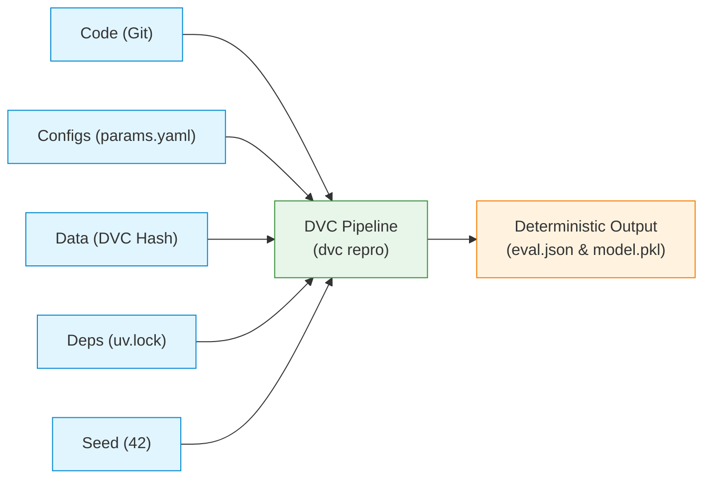
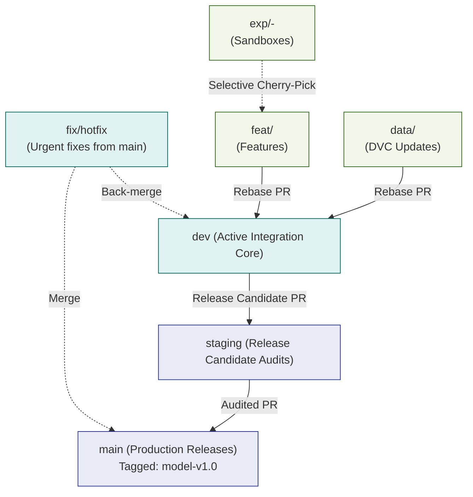
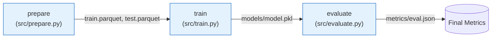

# California Housing MLOps Pipeline: Master Execution Plan

> **Assignment 01: Git-Based Collaboration for an ML Project**  
> **Repository:** [`nyc_mobility_ml`](https://github.com/m-hassanqureshi/nyc_mobility_ml) | **Benchmark:** California Housing (~2.8 MB) | **Target:** `MedHouseVal`

---

## 1. Quick Overview & Architecture

This plan coordinates the 3-person team to build a fully reproducible, CI-tested machine learning pipeline using **Git**, **DVC**, **uv**, and **GitHub Actions**.

### The 5 Pillars of Reproducibility
A machine learning pipeline is only reproducible if all 5 pillars are locked:

$$\text{Reproducibility Contract} = \langle \text{Git Commit}, \; \text{params.yaml}, \; \text{DVC Hash}, \; \text{uv.lock}, \; \text{Global Seed (42)} \rangle$$



---

## 2. Team Roster & Responsibilities

| Member | Role | Core Accountabilities | Key Deliverables |
| :--- | :--- | :--- | :--- |
| **Muhammad Hassan (Lead)** | **Data Owner** | DVC setup, S3 remote, data versioning, data-update PR, clean-clone audit | `data/raw/*`, `california_housing.csv.dvc`, `src/prepare.py` |
| **Ahmad** | **Model Owner** | Feature engineering, LightGBM training, DVC pipeline DAG, experiment runs | `configs/params.yaml`, `dvc.yaml`, `src/train.py`, `src/evaluate.py` |
| **Moeed** | **Platform / DevOps** | Branch protection, pre-commit hooks, CI workflow, merge conflict, hotfix | `.pre-commit-config.yaml`, `.github/workflows/ci.yml`, `tests/*` |

---

## 3. Branching Strategy (One-Way Integration Flow)

> [!IMPORTANT]
> **Golden Rule:** Never push directly to `dev`, `staging`, or `main`. All code enters through reviewed Pull Requests.



* **`main`**: Production code only. Releases are tagged (e.g. `model-v1.0`).
* **`staging`**: Pre-release verification branch where independent teammates test clean replication.
* **`dev`**: Daily integration branch. All feature branches merge here via Rebase PRs.
* **`feat/*` & `data/*`**: Short-lived task branches deleted post-merge.
* **`exp/*`**: Personal experiment branches. **Never merged directly to `dev`**.

---

## 4. The 9 Implementation Phases (At a Glance)

### Phase 1: Team & Repo Setup
* **Lead:** Hassan | **Reviewers:** Ahmad, Moeed
* **Goal:** Initialize GitHub repo, invite collaborators, and standardize local git config.
```bash
git clone https://github.com/m-hassanqureshi/nyc_mobility_ml.git
cd nyc_mobility_ml
git config user.name "Your Name"
git config user.email "your_email@domain.com"
git config pull.rebase true
```

---

### Phase 2: Scaffolding & Baseline Code
* **Lead:** Hassan (Structure) & Ahmad (Python Code)
* **Goal:** Create standardized directories, virtual environment (`uv`), and baseline ML scripts.
```bash
# 1. Project directories
mkdir -p configs data/raw data/processed models notebooks src tests .github/workflows

# 2. Virtual environment setup via uv
uv init --no-pin-python
uv add pandas==2.2.2 numpy==1.26.4 scikit-learn==1.5.0 pyarrow==16.1.0 lightgbm==4.3.0 pyyaml==6.0.1 dvc==3.51.0 dvc-s3==3.2.0
uv add --dev pytest==8.2.2 ruff==0.4.8 pre-commit==3.7.1 jupytext==1.16.2 nbstripout==0.7.1 cml==0.2.1

# 3. Create branches and push to remote
git add . && git commit -m "chore: scaffold project and lock uv dependencies"
git branch -M main && git push -u origin main
git checkout -b staging && git push -u origin staging
git checkout -b dev && git push -u origin dev
```
* **Branch Protections (Moeed):** In GitHub Settings, protect `main`, `staging`, and `dev` (Require 1 PR approval + linear history).

---

### Phase 3: Pre-Commit Guardrails
* **Lead:** Moeed (branch `feat/pre-commit-gates`)
* **Goal:** Automatically block large files (> 1MB), API keys/secrets, and unformatted code locally.
```bash
# Install hooks from .pre-commit-config.yaml
uv run pre-commit install

# Verify blocking works (Test failure locally & take screenshot for REPORT.md)
echo "AWS_SECRET_ACCESS_KEY=AKIAIOSFODNN7EXAMPLEKEY123456" > test_leak.py
git add test_leak.py
git commit -m "test: simulate secret leak"  # <-- Blocked by gitleaks!
rm test_leak.py && git reset
```

---

### Phase 4: Data Tracking with DVC
* **Lead:** Hassan (branch `data/initial-dataset`)
* **Goal:** Store raw data in remote storage (S3/DagsHub), keeping only `.dvc` pointer files in Git.
```bash
# 1. Initialize DVC and configure remote storage
uv run dvc init
uv run dvc remote add -d storage s3://california-housing-mlops-bucket/dvcstore

# 2. Fetch baseline data and track via DVC
uv run python src/prepare.py
uv run dvc add data/raw/california_housing.csv
uv run dvc push

# 3. Commit only the .dvc pointer to Git
git add data/raw/california_housing.csv.dvc data/raw/.gitignore .dvc/config
git commit -m "data: track raw california housing dataset with DVC"
git push origin data/initial-dataset  # Open PR to dev
```
* **Peer Audit (Ahmad):** Ahmad checks out the PR, runs `uv run dvc pull`, verifies the hash matches, and approves.

---

### Phase 5: Notebook Governance
* **Lead:** Ahmad (branch `feat/eda-notebook`)
* **Goal:** Maintain clean Jupyter notebooks paired with Python scripts and stripped of raw outputs.
```bash
# Pair notebook with percent-format python script
uv run jupytext --set-formats ipynb,py:percent notebooks/01_eda.ipynb

# Strip execution outputs before committing
uv run nbstripout notebooks/01_eda.ipynb
git add notebooks/ src/features.py tests/test_features.py
git commit -m "feat: add eda notebook and extracted feature functions"
```
* Extract analytical logic into `src/features.py` with unit tests in `tests/test_features.py`.

---

### Phase 6: End-to-End DVC Pipeline
* **Lead:** Ahmad (branch `feat/dvc-pipeline`)
* **Goal:** Define a reproducible 3-stage pipeline DAG in `dvc.yaml`.



```bash
# Run the pipeline and push lockfiles
uv run dvc repro
uv run dvc metrics show
uv run dvc push
git add configs/params.yaml dvc.yaml dvc.lock metrics/eval.json
git commit -m "feat: establish end-to-end reproducible dvc pipeline"
```
* **Auditor Reproduction (Hassan):** Hassan clones to `/tmp`, runs `uv sync && dvc pull && dvc repro`, and verifies identical metrics ($R^2 \approx 0.841$).

---

### Phase 7: Experiments & Conflict Resolution
* **Lead:** Team
* **Goal:** Each member runs $\ge 3$ hyperparameter experiments using `dvc exp run`.
```bash
# Hassan runs deep-tree sweep (WINNING RUN)
git checkout -b exp/hassan-deep-trees
uv run dvc exp run --set-param train.max_depth=10 --set-param train.num_leaves=128

# Ahmad runs regularization sweep
git checkout -b exp/ahmad-regularization
uv run dvc exp run --set-param train.subsample=0.6 --set-param train.learning_rate=0.02

# Moeed runs learning-rate sweep (Explodes -> intentionally abandoned)
git checkout -b exp/moeed-lr-sweep
uv run dvc exp run --set-param train.learning_rate=0.8
```

#### Simulated Merge Conflict & Resolution
1. **Ahmad** changes `learning_rate: 0.04` in `configs/params.yaml` on `feat/tune-lr` $\rightarrow$ merged to `dev`.
2. **Moeed** changes `learning_rate: 0.08` on `feat/tune-estimators` $\rightarrow$ hits conflict on PR.
3. **Resolution:** Moeed runs `git rebase origin/dev`, resolves conflict to `0.05`, reruns `dvc repro`, and force-pushes with lease.

---

### Phase 8: Continuous Integration (GitHub Actions)
* **Lead:** Moeed (branch `feat/ci-automation`)
* **Goal:** Automate quality checks on every PR via `.github/workflows/ci.yml`.

**CI Workflow Steps:**
1. Checkout code (`actions/checkout@v4`).
2. Setup `uv` and synchronize environment (`uv sync`).
3. Run linting (`uv run ruff check .` and `uv run ruff format --check .`).
4. Run tests (`uv run pytest tests/`).
5. Pull DVC data and execute smoke pipeline test (`uv run python src/prepare.py && ...`).
6. Post CML metric report as an automated comment on the Pull Request.

---

### Phase 9: Staging, Release & Hotfix
* **Lead:** Hassan & Moeed
* **Goal:** Promote to `staging`, conduct independent validation, merge to `main`, and simulate a production hotfix.

```bash
# 1. Independent Audit on staging (Ahmad)
git checkout staging && uv sync && dvc pull && dvc repro

# 2. Promote to main & Tag Release (Hassan)
git checkout main && git pull origin main
git tag -a model-v1.0 -m "Production release model-v1.0: R2=0.8680, RMSE=0.4120"
git push origin model-v1.0

# 3. Emergency Hotfix (Moeed)
git checkout -b fix/timestamp-logging main
# Add ISO timestamp to src/evaluate.py
uv run dvc repro
git commit -m "fix: add iso timestamp to evaluation metrics"
# Merge PR to main -> Tag model-v1.0.1 -> Back-merge main into dev
```

---

## 5. Experiment Results Matrix (`dvc exp show`)

| Experiment Marker | Context | Key Params (`lr`, `depth`, `leaves`) | RMSE | $R^2$ | Outcome / Decision |
| :--- | :--- | :--- | :---: | :---: | :--- |
| `exp-base` | `dev` | `0.05`, `6`, `31` | $0.4482$ | $0.8412$ | Baseline |
| **`exp-hassan-2`** | `exp/hassan-deep-trees` | `0.05`, `10`, `128` | **$0.4120$** | **$0.8680$** | **Promoted Winner** (+3.2% $R^2$) |
| `exp-ahmad-2` | `exp/ahmad-regularization`| `0.02`, `6`, `31` | $0.4620$ | $0.8280$ | Underfitting |
| `exp-moeed-3` | `exp/moeed-lr-sweep` | `0.80`, `6`, `31` | $1.2140$ | $-0.1200$ | **Abandoned** (Diverged) |

---

## 6. Master Step-by-Step Checklist

- [ ] **1. (Hassan)** Clone repository, verify access for Ahmad and Moeed.
- [ ] **2. (Hassan)** Create folder structure and baseline source scripts (`src/`).
- [ ] **3. (Ahmad)** Initialize `uv`, add dependencies, and commit `uv.lock`.
- [ ] **4. (Hassan)** Push `main`, create `staging` and `dev` branches, configure branch protections.
- [ ] **5. (Moeed)** Author `CONTRIBUTING.md`, PR into `dev`, merge via rebase.
- [ ] **6. (Moeed)** Add `.pre-commit-config.yaml`, verify local blocks (secret & 1MB file), save screenshot.
- [ ] **7. (Hassan)** Initialize DVC, add S3 remote, track `california_housing.csv`, push data, PR to `dev`.
- [ ] **8. (Ahmad)** Audit Hassan's data PR with `dvc pull`, verify matching md5 hash, merge.
- [ ] **9. (Ahmad)** Add EDA notebook, pair with `jupytext`, extract functions to `src/features.py`, test.
- [ ] **10. (Ahmad)** Create `configs/params.yaml` & `dvc.yaml`, run `dvc repro`, commit `dvc.lock`.
- [ ] **11. (Hassan)** Test clean reproduction in `/tmp`, verify bit-for-bit identical metrics, merge to `dev`.
- [ ] **12. (Team)** Each member executes 3 experiment runs via `dvc exp run` on their `exp/*` branch.
- [ ] **13. (Hassan)** Apply winning experiment (`hassan-run-2`), PR to `dev`, verify $R^2=0.8680$.
- [ ] **14. (Hassan)** Create `data/remove-outliers` PR to demonstrate DVC data version switching.
- [ ] **15. (Ahmad & Moeed)** Simulate merge conflict on `params.yaml`; Moeed resolves via rebase.
- [ ] **16. (Moeed)** Execute formal "Changes Requested" review on Ahmad's PR flagging simulated data leakage.
- [ ] **17. (Moeed)** Document abandoned `exp/moeed-lr-sweep` branch in `REPORT.md`.
- [ ] **18. (Moeed)** Add GitHub Actions CI workflow with CML comments, verify green check.
- [ ] **19. (Hassan)** Open Release Candidate PR (`dev` $\rightarrow$ `staging`).
- [ ] **20. (Ahmad)** Perform independent clean audit on `staging`, certify metric stability.
- [ ] **21. (Hassan)** Merge `staging` $\rightarrow$ `main`, tag cryptographic release `model-v1.0`.
- [ ] **22. (Moeed)** Execute emergency hotfix on `fix/*`, merge to `main`, tag `model-v1.0.1`, back-merge to `dev`.
- [ ] **23. (Team)** Finalize `REPORT.md` with links, metric logs, and screenshots, and submit.