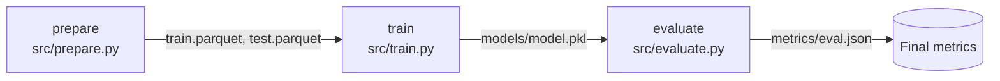

california_housing_mlops
==============================

[](https://github.com/m-hassanqureshi/california_housing_mlops/actions/workflows/ci.yml)

A fully reproducible, CI-tested machine-learning pipeline for the **California Housing** dataset, built with **Git**, **DVC**, **uv**, and **GitHub Actions**.

* **Repository:** <https://github.com/m-hassanqureshi/california_housing_mlops>
* **Dataset:** California Housing (~2.8 MB, 20,640 rows x 9 features)
* **Target:** `MedHouseVal` (median house value)

---

## Reproducibility contract

A run is reproducible only when all five pillars are pinned:

```
<Git commit, params.yaml, DVC hash, uv.lock, seed=42>  ->  dvc repro  ->  identical metrics
```

| Pillar | Artifact |
| :--- | :--- |
| Code | Git commit |
| Config | `configs/params.yaml` |
| Data | DVC hash (`data/raw/california_housing.csv.dvc`) |
| Dependencies | `uv.lock` |
| Randomness | global seed (42) |

---

## Getting started

```bash
# 1. Clone and sync the environment
git clone https://github.com/m-hassanqureshi/california_housing_mlops.git
cd california_housing_mlops
uv sync

# 2. Configure the DVC remote credentials (DagsHub token, kept local only)
uv run dvc remote modify storage --local auth basic
uv run dvc remote modify storage --local user <your-dagshub-username>
uv run dvc remote modify storage --local password <your-dagshub-token>

# 3. Pull data and reproduce the pipeline end-to-end
uv run dvc pull
uv run dvc repro
uv run dvc metrics show
```

`uv run dvc repro` reproduces every stage from the tracked code, config, and data with no manual steps.

---

## Project organization

```
├── configs
│   └── params.yaml        <- Pipeline hyperparameters (single source of truth)
├── data
│   ├── external           <- Data from third-party sources
│   ├── interim            <- Intermediate, transformed data
│   ├── processed          <- Final canonical datasets for modeling
│   └── raw                <- Original, immutable data dump (DVC-tracked)
├── docs                   <- Sphinx documentation
├── models                 <- Trained and serialized models
├── notebooks              <- Jupyter notebooks (paired with jupytext, outputs stripped)
├── references             <- Data dictionaries and explanatory material
├── reports                <- Generated analysis (figures, metrics)
├── src
│   ├── prepare.py         <- Download raw California Housing data -> data/raw
│   ├── remove_outliers.py <- IQR outlier removal (demonstrates DVC data versioning)
│   ├── data               <- Data download / generation scripts
│   ├── features           <- Feature engineering (build_features.py)
│   ├── models             <- Training and prediction (train_model.py, predict_model.py)
│   └── visualization      <- Exploratory and results visualizations
├── tests                  <- Unit tests (pytest)
├── dvc.yaml               <- DVC pipeline DAG (prepare -> train -> evaluate)
├── pyproject.toml         <- Project metadata and dependencies (uv)
└── uv.lock                <- Locked, reproducible dependency set
```

---

## DVC pipeline



| Stage | Command | Outputs |
| :--- | :--- | :--- |
| prepare | `dvc repro prepare` | `data/processed/train.parquet`, `data/processed/test.parquet` |
| train | `dvc repro train` | `models/model.pkl` |
| evaluate | `dvc repro evaluate` | `metrics/eval.json` |

---

## Data versioning

The raw dataset is stored in a DVC remote (DagsHub); only the `.dvc` pointer is committed to Git. To switch between dataset versions:

```bash
# use the version tracked by the current commit
uv run dvc checkout

# switch to a different version, e.g. the outlier-removed dataset
git checkout <branch> -- data/raw/california_housing.csv.dvc
uv run dvc checkout
```

---

## Development

```bash
uv run ruff check .          # lint
uv run ruff format --check . # format check
uv run pytest tests/         # tests
uv run pre-commit run --all-files
```

---

## Team & workflow

| Member | Role |
| :--- | :--- |
| Muhammad Hassan | Lead / Data Owner |
| Ahmad | Model Owner |
| Moeed | Platform / DevOps |

One-way integration flow (all changes enter via reviewed PRs):

```
feat/*  data/*  ->  dev  ->  staging  ->  main
```

* `main` holds production releases, tagged per release (e.g. `model-v1.0`).
* `staging` is for independent clean-replication audits.
* `dev` is the daily integration branch (rebase merges, linear history).
* `exp/*` are personal experiment sandboxes and are **never merged directly**.

See [`PLAN.md`](PLAN.md) for the full execution plan and [`CONTRIBUTING.md`](CONTRIBUTING.md) for contribution guidelines.

---

## License

Released under the terms in [`LICENSE`](LICENSE).

<sub>Project based on the <a target="_blank" href="https://drivendata.github.io/cookiecutter-data-science/">cookiecutter data science</a> project template.</sub>
